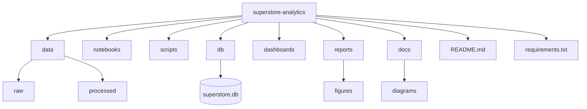

# Folder Structure

## Folder structure v1.0

```mermaid
flowchart TD
    A[superstore-analytics]

    A --> B[data]
    B --> B1[raw]
    B --> B2[processed]

    A --> C[notebooks]

    A --> D[scripts]

    A --> E[db]
    E --> E1[(superstore.db)]

    A --> F[dashboards]
  

    A --> G[reports]
    G --> G2[figures]

    A --> H[docs]
    H --> H1[diagrams]


    A --> I[README.md]
    A --> J[requirements.txt]
```